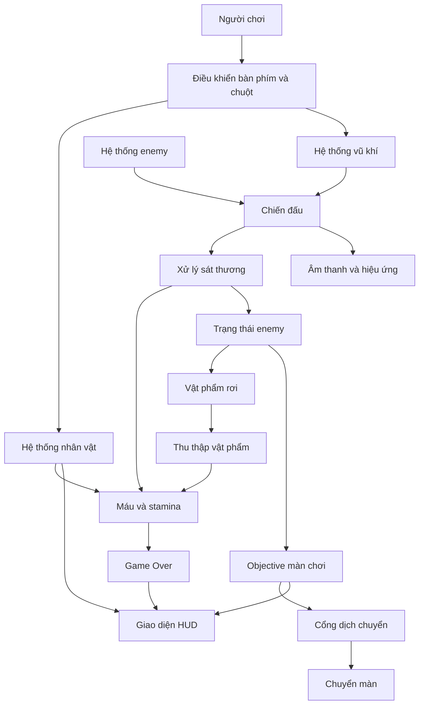
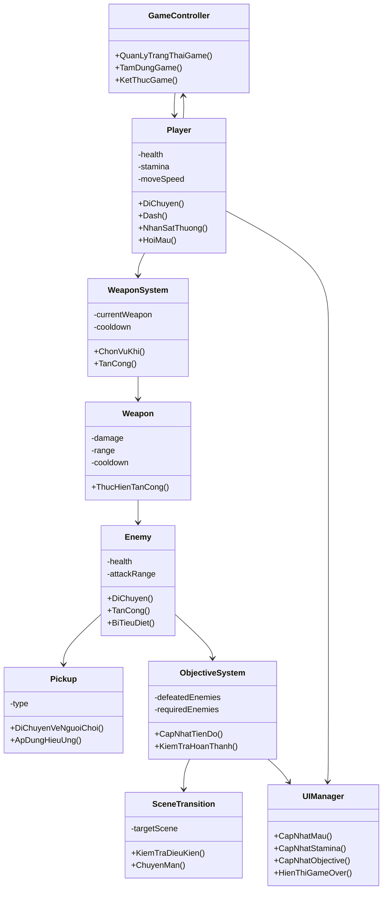

# TRƯỜNG ĐẠI HỌC ĐÀ LẠT
# KHOA CÔNG NGHỆ THÔNG TIN

 

# BÁO CÁO TIỂU LUẬN

## HỌC PHẦN: PHÁT TRIỂN ỨNG DỤNG GAME 2D

## ĐỀ TÀI: XÂY DỰNG GAME 2D "TWILIGHT FOREST"

 

**Giảng viên phụ trách học phần:** Nguyễn Trọng Hiếu  
**Sinh viên thực hiện:** 2312590 - Nguyễn Ngọc Trường Dân  
**Thời gian thực hiện:** 05/2026  
**Địa điểm:** Lâm Đồng

 

---

# NHẬN XÉT CỦA GIẢNG VIÊN

...........................................................................................................................................

...........................................................................................................................................

...........................................................................................................................................

...........................................................................................................................................

...........................................................................................................................................

...........................................................................................................................................

...........................................................................................................................................

...........................................................................................................................................

...........................................................................................................................................

Lâm Đồng, ngày …… tháng …… năm ……

Giảng viên

---

# MỤC LỤC

CHƯƠNG 1. GIỚI THIỆU

1.1. Giới thiệu đề tài  
1.2. Mục tiêu  
1.3. Phạm vi  
1.4. Công nghệ sử dụng  

CHƯƠNG 2. PHÂN TÍCH VÀ THIẾT KẾ

2.1. Mô tả gameplay  
2.2. Kiến trúc hệ thống  
2.3. Thiết kế các hệ thống chính  
2.4. Sơ đồ lớp  

CHƯƠNG 3. THỰC HIỆN

3.1. Tổ chức thực hiện  
3.2. Các tính năng đã thực hiện  
3.3. Các xử lý kỹ thuật trọng tâm  
3.4. Giao diện người dùng  

CHƯƠNG 4. KẾT QUẢ

4.1. Hình ảnh minh họa gameplay  
4.2. Kết quả đạt được  
4.3. Hạn chế  

CHƯƠNG 5. KẾT LUẬN VÀ HƯỚNG PHÁT TRIỂN

5.1. Kết luận  
5.2. Kinh nghiệm rút ra  
5.3. Hướng phát triển  

TÀI LIỆU THAM KHẢO

---

# DANH MỤC HÌNH ẢNH

| Ký hiệu | Tên hình | Nội dung |
|---|---|---|
| Hình 2.1 | Kiến trúc tổng thể của trò chơi | Mô tả quan hệ giữa các hệ thống chính |
| Hình 2.2 | Sơ đồ lớp khái quát | Mô tả các nhóm đối tượng chính trong thiết kế |
| Hình 4.1 | Màn hình menu chính | Giao diện khởi động trò chơi |
| Hình 4.2 | Màn hình gameplay | Nhân vật di chuyển trong bản đồ |
| Hình 4.3 | Cảnh chiến đấu | Người chơi tấn công enemy |
| Hình 4.4 | Cảnh thu thập vật phẩm | Vật phẩm xuất hiện sau khi enemy bị tiêu diệt |
| Hình 4.5 | Giao diện HUD | Máu, stamina, vàng, objective và inventory |
| Hình 4.6 | Màn hình Game Over | Giao diện khi nhân vật hết máu |

# DANH MỤC BẢNG BIỂU

| Ký hiệu | Tên bảng | Nội dung |
|---|---|---|
| Bảng 1.1 | Công nghệ sử dụng | Các công nghệ, công cụ chính được sử dụng trong dự án |
| Bảng 2.1 | Quy tắc gameplay | Tóm tắt các quy tắc vận hành chính của trò chơi |
| Bảng 2.2 | Các hệ thống chính | Phân rã chức năng của trò chơi |
| Bảng 3.1 | Kết quả hiện thực tính năng | Tổng hợp các chức năng đã xây dựng |
| Bảng 4.1 | Đánh giá mục tiêu | Đối chiếu mục tiêu ban đầu và kết quả đạt được |

---

# CHƯƠNG 1. GIỚI THIỆU

## 1.1. Giới thiệu đề tài

Đề tài được thực hiện với tên game là **Twilight Forest**. Đây là một trò chơi 2D lấy bối cảnh khu rừng giả tưởng, trong đó người chơi điều khiển nhân vật vượt qua các khu vực nguy hiểm, chiến đấu với enemy, thu thập vật phẩm hỗ trợ và mở cổng dịch chuyển để tiếp tục hành trình. Việc lựa chọn đề tài này xuất phát từ mong muốn xây dựng một sản phẩm game có vòng lặp gameplay rõ ràng, phạm vi vừa sức với học phần, đồng thời thể hiện được nhiều kỹ thuật quan trọng trong phát triển game 2D.

Về thể loại, Twilight Forest thuộc nhóm **game 2D hành động phiêu lưu góc nhìn từ trên xuống**. Trò chơi có một số đặc điểm gần với action RPG quy mô nhỏ, thể hiện qua cơ chế điều khiển nhân vật tự do, sử dụng nhiều loại vũ khí, chiến đấu với enemy, quản lý máu và stamina, thu thập vật phẩm và chuyển sang khu vực mới sau khi hoàn thành mục tiêu. Tuy nhiên, trong phạm vi tiểu luận, sản phẩm chưa hướng đến một game nhập vai hoàn chỉnh với hệ thống cấp độ, nhiệm vụ dài hoặc phát triển nhân vật chuyên sâu. Trọng tâm của đề tài là xây dựng một prototype game 2D có thể chơi được và có đầy đủ các hệ thống nền tảng.

Ý tưởng của trò chơi được lấy cảm hứng từ các game 2D phiêu lưu có nhịp chơi nhanh, trong đó người chơi liên tục di chuyển, né tránh, tấn công và thu thập phần thưởng sau mỗi cuộc chạm trán. Bối cảnh khu rừng được lựa chọn vì phù hợp với phong cách đồ họa 2D, dễ triển khai bằng tilemap và có thể tạo nhiều yếu tố môi trường như cây, bụi, đá, cổng dịch chuyển, sinh vật rừng và vùng chiến đấu. Tên gọi Twilight Forest gợi cảm giác về một khu rừng lúc chạng vạng, vừa có tính phiêu lưu vừa có yếu tố bí ẩn, phù hợp với không khí của một trò chơi hành động giả tưởng.

Đối tượng người chơi mục tiêu của Twilight Forest là những người yêu thích game 2D đơn giản, dễ tiếp cận, có thời lượng chơi ngắn và cơ chế điều khiển quen thuộc bằng bàn phím kết hợp chuột. Trò chơi phù hợp với người chơi muốn trải nghiệm một sản phẩm hành động nhẹ, không yêu cầu đọc nhiều hướng dẫn, nhưng vẫn có đủ yếu tố thử thách thông qua enemy, tài nguyên stamina, lựa chọn vũ khí và điều kiện mở cổng. Vì vậy, trò chơi hướng đến tính trực quan và khả năng chơi thử nhanh hơn là chiều sâu chiến thuật phức tạp.

Về cốt truyện, phiên bản hiện tại của Twilight Forest chưa xây dựng tuyến truyện dài, nhân vật phụ hoặc hội thoại. Bối cảnh có thể được hiểu ở mức khái quát: nhân vật chính lạc vào một khu rừng chạng vạng, nơi các sinh vật thù địch xuất hiện và cản đường. Để thoát khỏi từng khu vực, nhân vật phải đánh bại các enemy trong màn, thu thập vật phẩm hỗ trợ và kích hoạt cổng dịch chuyển. Cách xây dựng cốt truyện ở mức nền như vậy phù hợp với quy mô prototype, đồng thời vẫn tạo được lý do hợp lý cho các hành động chính của người chơi trong gameplay.

## 1.2. Mục tiêu

Mục tiêu đầu tiên của đề tài là xây dựng được một trò chơi 2D có thể vận hành và chơi thử trong Unity. Trò chơi cần có màn hình menu chính, màn chơi, nhân vật điều khiển được, enemy, hệ thống vũ khí, vật phẩm, giao diện trạng thái, điều kiện thua và cơ chế chuyển màn. Những thành phần này tạo thành nền tảng tối thiểu để sản phẩm có thể được xem như một prototype hoàn chỉnh thay vì chỉ là các chức năng rời rạc.

Mục tiêu thứ hai là thiết kế được một vòng lặp gameplay rõ ràng. Người chơi bắt đầu từ menu, vào màn chơi, điều khiển nhân vật chiến đấu, tiêu diệt enemy, thu thập vật phẩm, hoàn thành objective và đi qua cổng dịch chuyển. Nếu nhân vật hết máu, trò chơi chuyển sang trạng thái Game Over. Vòng lặp này giúp sản phẩm có điểm bắt đầu, tiến trình chơi và điểm kết thúc tương đối đầy đủ.

Mục tiêu thứ ba là vận dụng các kiến thức của học phần vào một sản phẩm cụ thể. Trong quá trình thực hiện, sinh viên cần sử dụng kiến thức về lập trình C#, xử lý input, va chạm 2D, animation, UI, âm thanh, prefab, scene và tổ chức hệ thống trong Unity. Ngoài ra, báo cáo cũng hướng đến việc trình bày quá trình phân tích, thiết kế, hiện thực và đánh giá sản phẩm theo phong cách học thuật, phù hợp với yêu cầu của một bài tiểu luận cuối kỳ.

## 1.3. Phạm vi

Trong phạm vi của đề tài, Twilight Forest được xây dựng như một prototype game 2D thay vì một sản phẩm thương mại hoàn chỉnh. Sản phẩm tập trung vào các chức năng cốt lõi: menu chính, nhân vật, di chuyển, dash, máu, stamina, vũ khí, enemy, vật phẩm, objective, chuyển màn, giao diện gameplay, pause và game over. Những chức năng này đủ để tạo nên một lượt chơi có tính hoàn chỉnh và có thể đánh giá được.

Dự án có hai màn chơi gameplay. Màn đầu đóng vai trò giới thiệu cơ chế chiến đấu cơ bản với enemy đơn giản, trong khi màn tiếp theo tăng thử thách thông qua enemy có khả năng gây áp lực từ xa. Việc giới hạn số lượng màn chơi giúp dự án tập trung vào chất lượng của các hệ thống nền tảng thay vì dàn trải sang quá nhiều nội dung.

Một số nội dung chưa được đưa vào phạm vi hiện tại do giới hạn thời gian và quy mô học phần. Trò chơi chưa có chế độ chơi nhiều người, chưa có hệ thống lưu tiến trình đầy đủ, chưa có cốt truyện phân nhánh, chưa có hệ thống nâng cấp nhân vật hoặc vũ khí, chưa có cửa hàng, chưa có boss hoàn chỉnh và chưa có AI nâng cao. Những nội dung này được xem là hướng phát triển cho các phiên bản sau.

## 1.4. Công nghệ sử dụng

**Bảng 1.1. Công nghệ sử dụng trong dự án**

| Công nghệ / công cụ | Vai trò trong dự án |
|---|---|
| Unity 6 | Môi trường phát triển chính, dùng để xây dựng scene, gameplay, UI, animation và quản lý tài nguyên |
| C# | Ngôn ngữ lập trình dùng để hiện thực logic trò chơi |
| Unity Input System | Xử lý thao tác bàn phím và chuột của người chơi |
| Rigidbody2D và Collider2D | Xử lý di chuyển, va chạm, trigger và tương tác vật lý 2D |
| Tilemap 2D | Xây dựng bản đồ, nền và các lớp môi trường |
| Animator | Quản lý animation của nhân vật, enemy, vũ khí và vật phẩm |
| Cinemachine | Hỗ trợ camera theo dõi nhân vật và tạo hiệu ứng rung màn hình |
| TextMesh Pro / Unity UI | Xây dựng chữ, nút bấm, thanh máu, HUD và các panel giao diện |
| Visual Studio / VS Code | Môi trường viết và chỉnh sửa chương trình |
| Git / GitHub | Quản lý phiên bản trong quá trình phát triển |

Nhìn chung, các công nghệ được lựa chọn đều phù hợp với mục tiêu xây dựng game 2D trong phạm vi học phần. Unity cung cấp đầy đủ công cụ để xây dựng scene, quản lý asset, xử lý animation, vật lý 2D và giao diện. C# đóng vai trò là ngôn ngữ lập trình chính, giúp hiện thực logic gameplay theo hướng rõ ràng và có khả năng mở rộng.

---

# CHƯƠNG 2. PHÂN TÍCH VÀ THIẾT KẾ

## 2.1. Mô tả gameplay

Twilight Forest được thiết kế xoay quanh vòng lặp gameplay gồm khám phá, chiến đấu, thu thập và chuyển màn. Khi bắt đầu trò chơi, người chơi xuất hiện trong một khu vực rừng. Trong khu vực này, enemy được bố trí để tạo thử thách. Người chơi cần điều khiển nhân vật di chuyển, né tránh các nguy hiểm, sử dụng vũ khí để tiêu diệt enemy và hoàn thành objective của màn chơi. Sau khi objective hoàn thành, cổng dịch chuyển được mở, cho phép người chơi sang khu vực tiếp theo.

Cơ chế điều khiển của trò chơi được thiết kế theo hướng quen thuộc với người chơi game trên máy tính. Nhân vật di chuyển bằng bàn phím theo bốn hướng, trong khi hướng tấn công được điều khiển bằng chuột. Cách kết hợp này giúp người chơi vừa di chuyển vừa định hướng tấn công một cách linh hoạt. Bên cạnh di chuyển thông thường, nhân vật có thể dash trong thời gian ngắn. Dash tiêu hao stamina, do đó người chơi không thể sử dụng liên tục mà cần cân nhắc thời điểm phù hợp.

Hệ thống chiến đấu của trò chơi cho phép người chơi sử dụng nhiều loại vũ khí. Kiếm phù hợp với tấn công cận chiến, cung phù hợp với tấn công từ xa, còn gậy phép tạo ra đòn đánh có phạm vi và sức mạnh khác biệt. Mỗi vũ khí có nhịp sử dụng riêng thông qua thời gian hồi chiêu, từ đó tạo sự khác biệt trong lựa chọn chiến thuật. Người chơi có thể thay đổi vũ khí trong quá trình chơi để thích ứng với từng tình huống.

Enemy trong trò chơi đóng vai trò tạo áp lực và buộc người chơi phải tương tác với hệ thống chiến đấu. Một số enemy gây nguy hiểm bằng va chạm trực tiếp, trong khi một số khác có thể tấn công từ xa. Khi enemy bị tiêu diệt, chúng có thể tạo vật phẩm rơi, bao gồm vàng, vật phẩm hồi máu hoặc hồi stamina. Cơ chế này tạo phần thưởng cho người chơi sau khi chiến đấu và khuyến khích người chơi tiếp tục hoàn thành objective.

Điều kiện hoàn thành một màn chơi không phải là đi thẳng đến cổng, mà là tiêu diệt đủ enemy được yêu cầu. Khi chưa hoàn thành objective, cổng chưa cho phép chuyển màn. Khi objective hoàn thành, trạng thái cổng được mở và người chơi có thể tiếp tục sang khu vực tiếp theo. Điều kiện thua xảy ra khi máu của nhân vật về 0. Khi đó, trò chơi chuyển sang màn hình Game Over, dừng gameplay và cho phép người chơi chọn chơi lại hoặc quay về menu chính.

**Bảng 2.1. Quy tắc gameplay chính**

| Thành phần | Quy tắc hoạt động |
|---|---|
| Di chuyển | Người chơi điều khiển nhân vật di chuyển tự do theo bốn hướng trong môi trường 2D |
| Định hướng | Hướng nhìn và hướng tấn công được xác định theo vị trí chuột |
| Dash | Dash giúp nhân vật lướt nhanh trong thời gian ngắn và tiêu hao stamina |
| Máu | Nhân vật mất máu khi va chạm với enemy hoặc bị projectile đánh trúng |
| Stamina | Stamina được sử dụng cho dash và có thể phục hồi theo thời gian hoặc thông qua vật phẩm |
| Vũ khí | Mỗi vũ khí có cách tấn công, tầm đánh, sát thương và nhịp hồi chiêu riêng |
| Enemy | Enemy có thể di chuyển, tiếp cận hoặc tấn công người chơi tùy loại |
| Objective | Người chơi cần tiêu diệt đủ enemy để mở cổng chuyển màn |
| Game Over | Trò chơi kết thúc lượt chơi khi máu nhân vật bằng 0 |

## 2.2. Kiến trúc hệ thống

Về mặt kiến trúc, Twilight Forest được tổ chức theo mô hình component-based, phù hợp với cách Unity xây dựng trò chơi. Mỗi đối tượng trong game như nhân vật, enemy, vũ khí, vật phẩm, UI hoặc cổng dịch chuyển được cấu thành từ các thành phần chức năng nhỏ. Mỗi thành phần đảm nhận một trách nhiệm nhất định, từ đó giúp hệ thống dễ phát triển, dễ kiểm soát và dễ mở rộng hơn.

Ở mức tổng thể, trò chơi gồm tám hệ thống chính. Hệ thống nhân vật xử lý di chuyển, dash, máu và trạng thái sống/chết. Hệ thống vũ khí quản lý vũ khí đang được chọn, thời gian hồi chiêu và hành vi tấn công. Hệ thống enemy điều khiển hành vi, máu và trạng thái bị tiêu diệt của các đối tượng đối địch. Hệ thống vật phẩm xử lý việc sinh vật phẩm, hút vật phẩm về phía người chơi và áp dụng hiệu ứng thu thập. Hệ thống objective theo dõi tiến độ màn chơi. Hệ thống chuyển màn đảm bảo người chơi chỉ sang khu vực mới khi đủ điều kiện. Hệ thống giao diện hiển thị thông tin trạng thái và các panel quan trọng. Cuối cùng, hệ thống âm thanh và hiệu ứng tạo phản hồi trực quan cho các sự kiện gameplay.

**Bảng 2.2. Các hệ thống chính trong trò chơi**

| Hệ thống | Chức năng chính |
|---|---|
| Hệ thống nhân vật | Điều khiển di chuyển, dash, hướng nhìn, máu và trạng thái game over |
| Hệ thống vũ khí | Quản lý vũ khí, sát thương, tầm đánh và thời gian hồi chiêu |
| Hệ thống enemy | Quản lý di chuyển, tấn công, nhận sát thương và bị tiêu diệt |
| Hệ thống vật phẩm | Sinh vật phẩm, di chuyển về người chơi và áp dụng hiệu ứng thu thập |
| Hệ thống objective | Theo dõi số enemy bị tiêu diệt và xác định điều kiện mở cổng |
| Hệ thống chuyển màn | Kiểm tra điều kiện, tạo hiệu ứng chuyển cảnh và đưa người chơi sang màn mới |
| Hệ thống giao diện | Hiển thị HUD, menu, pause và game over |
| Hệ thống âm thanh - hiệu ứng | Phát âm thanh, hiệu ứng đánh trúng, hiệu ứng biến mất và rung màn hình |

**Hình 2.1. Kiến trúc tổng thể của trò chơi**

Sơ đồ trên thể hiện mối quan hệ giữa các hệ thống ở mức khái quát. Người chơi tạo input để điều khiển nhân vật và vũ khí. Hành động chiến đấu làm thay đổi trạng thái enemy hoặc trạng thái nhân vật. Khi enemy bị tiêu diệt, objective được cập nhật và vật phẩm có thể xuất hiện. Khi objective hoàn thành, cổng dịch chuyển cho phép người chơi chuyển màn. Các thay đổi quan trọng đều được phản ánh lên giao diện và hiệu ứng nhằm bảo đảm người chơi nhận được phản hồi rõ ràng.

## 2.3. Thiết kế các hệ thống chính

### 2.3.1. Hệ thống nhân vật

Hệ thống nhân vật là trung tâm của trải nghiệm gameplay vì mọi hành động của người chơi đều được thể hiện thông qua nhân vật. Nhân vật được thiết kế để có thể di chuyển linh hoạt trong không gian 2D, quay hướng theo chuột và thực hiện dash khi cần né tránh hoặc tiếp cận enemy. Do trò chơi sử dụng góc nhìn từ trên xuống, cơ chế nhảy không được triển khai; thay vào đó, dash được xem là hành động cơ động đặc trưng của nhân vật.

Về trạng thái sinh tồn, nhân vật có lượng máu tối đa và có thể nhận sát thương từ va chạm hoặc đòn tấn công của enemy. Sau khi bị đánh, nhân vật có một khoảng thời gian ngắn không nhận thêm sát thương, giúp tránh tình trạng mất máu liên tục trong một va chạm duy nhất. Cách thiết kế này làm cho gameplay công bằng hơn, đồng thời tạo cơ hội để người chơi phản ứng sau khi mắc lỗi.

Stamina là tài nguyên phụ dùng để điều tiết hành động dash. Nếu dash không tiêu hao tài nguyên, người chơi có thể lạm dụng hành động này và làm giảm độ thử thách. Vì vậy, stamina được thiết kế như một giới hạn mềm: người chơi vẫn có thể sử dụng dash nhiều lần, nhưng cần chờ hồi phục hoặc thu thập vật phẩm hỗ trợ.

### 2.3.2. Hệ thống vũ khí

Hệ thống vũ khí được thiết kế theo hướng linh hoạt để hỗ trợ nhiều phong cách chiến đấu. Trong phiên bản hiện tại, trò chơi có ba nhóm vũ khí chính gồm kiếm, cung và gậy phép. Kiếm đại diện cho lối đánh cận chiến với nhịp tấn công nhanh; cung đại diện cho lối đánh tầm xa, cho phép người chơi giữ khoảng cách với enemy; gậy phép tạo ra đòn tấn công có cảm giác mạnh hơn nhưng thời gian hồi chiêu dài hơn.

Mỗi vũ khí có thông số riêng về sát thương, tầm đánh và thời gian hồi chiêu. Các thông số này giúp tạo sự khác biệt giữa các vũ khí, đồng thời tạo cơ sở cho việc cân bằng gameplay. Người chơi không chỉ chọn vũ khí theo sở thích mà còn cần cân nhắc tình huống. Khi enemy ở gần, kiếm có thể hiệu quả hơn. Khi enemy nguy hiểm ở cự ly gần, cung giúp người chơi giữ khoảng cách. Khi cần tạo sát thương mạnh hoặc kiểm soát khu vực, gậy phép trở thành lựa chọn phù hợp.

Việc quản lý vũ khí thông qua inventory giúp trò chơi có tính mở rộng. Nếu trong tương lai cần thêm vũ khí mới, hệ thống có thể mở rộng bằng cách bổ sung loại vũ khí mới với dữ liệu và hành vi tương ứng, thay vì thay đổi toàn bộ cơ chế chiến đấu.

### 2.3.3. Hệ thống enemy

Enemy là thành phần tạo thử thách chính trong Twilight Forest. Thiết kế enemy trong prototype hướng đến sự rõ ràng và dễ nhận biết. Có enemy thiên về va chạm trực tiếp, buộc người chơi giữ khoảng cách hoặc tiêu diệt nhanh. Có enemy tấn công từ xa, buộc người chơi quan sát hướng đạn và sử dụng dash hợp lý. Sự khác biệt này làm cho gameplay bớt đơn điệu, dù số lượng enemy chưa nhiều.

Mỗi enemy có lượng máu riêng. Khi bị tấn công, enemy nhận sát thương và tạo phản hồi bằng hiệu ứng hình ảnh hoặc lực đẩy lùi. Khi máu về 0, enemy bị tiêu diệt, tạo hiệu ứng biến mất và có khả năng sinh vật phẩm. Đồng thời, sự kiện enemy bị tiêu diệt được gửi đến hệ thống objective để cập nhật tiến độ màn chơi.

AI của enemy trong phiên bản hiện tại được xây dựng ở mức cơ bản. Enemy có thể di chuyển trong khu vực, chuyển sang trạng thái tấn công khi người chơi ở trong phạm vi và chờ thời gian hồi chiêu giữa các lần tấn công. Cách thiết kế này đủ để tạo ra thử thách trong prototype, đồng thời giữ độ phức tạp phù hợp với thời lượng của học phần.

### 2.3.4. Hệ thống vật phẩm

Vật phẩm trong trò chơi giữ vai trò tạo phần thưởng và hỗ trợ người chơi sau khi chiến đấu. Khi enemy hoặc một số vật thể bị phá hủy, vật phẩm có thể xuất hiện. Các vật phẩm bao gồm vàng, vật phẩm hồi máu và vật phẩm hồi stamina. Mỗi loại vật phẩm tác động đến một khía cạnh khác nhau của gameplay: vàng thể hiện tài nguyên thu thập, hồi máu giúp kéo dài thời gian sống sót, còn hồi stamina giúp người chơi tiếp tục sử dụng dash.

Vật phẩm không chỉ xuất hiện tĩnh trên bản đồ mà có hiệu ứng bật ra và bị hút về phía người chơi khi ở trong phạm vi nhất định. Cơ chế này làm cho việc thu thập trở nên mượt mà hơn, giảm cảm giác phải căn chỉnh vị trí quá chính xác. Khi vật phẩm chạm vào nhân vật, hiệu ứng tương ứng được áp dụng và vật phẩm biến mất khỏi màn chơi.

### 2.3.5. Hệ thống objective và chuyển màn

Objective của màn chơi được thiết kế theo nguyên tắc đơn giản nhưng hiệu quả: người chơi phải tiêu diệt đủ enemy để mở cổng. Quy tắc này tạo mục tiêu rõ ràng cho từng màn chơi và ngăn người chơi bỏ qua phần thử thách chính. Khi objective chưa hoàn thành, cổng dịch chuyển chưa thể sử dụng. Khi objective hoàn thành, giao diện thông báo trạng thái mở cổng và người chơi có thể chuyển sang khu vực tiếp theo.

Cơ chế chuyển màn không chỉ là thao tác nạp scene mới. Nó còn bao gồm kiểm tra điều kiện, tạo hiệu ứng chuyển cảnh, lưu hướng chuyển và đặt nhân vật tại vị trí phù hợp ở màn tiếp theo. Nhờ vậy, quá trình chuyển giữa các khu vực trở nên tự nhiên hơn và không gây cảm giác đứt đoạn cho người chơi.

### 2.3.6. Hệ thống giao diện

Giao diện người dùng được thiết kế để cung cấp thông tin cần thiết trong quá trình chơi mà không làm người chơi bị phân tâm quá nhiều. Trên màn hình gameplay, người chơi cần theo dõi máu, stamina, số vàng, objective và vũ khí đang chọn. Đây là các thông tin ảnh hưởng trực tiếp đến quyết định của người chơi khi chiến đấu.

Ngoài HUD trong gameplay, trò chơi còn có menu chính, màn hình pause và màn hình game over. Menu chính giúp người chơi bắt đầu trò chơi và thực hiện một số lựa chọn ban đầu. Màn hình pause cho phép tạm dừng khi cần thiết. Màn hình game over thông báo trạng thái thất bại và cung cấp lựa chọn chơi lại hoặc quay về menu. Những giao diện này giúp vòng đời của trò chơi trở nên hoàn chỉnh hơn.

### 2.3.7. Hệ thống âm thanh và hiệu ứng

Âm thanh và hiệu ứng là yếu tố quan trọng để tăng cảm giác phản hồi của gameplay. Khi một đòn đánh trúng mục tiêu, người chơi cần nhận biết điều đó qua hình ảnh và âm thanh. Khi nhân vật bị đánh, hiệu ứng rung màn hình hoặc nhấp nháy giúp nhấn mạnh trạng thái nguy hiểm. Khi chuyển màn hoặc game over, âm thanh riêng giúp người chơi nhận ra sự thay đổi trạng thái.

Mặc dù các hiệu ứng này không trực tiếp thay đổi luật chơi, chúng góp phần đáng kể vào chất lượng trải nghiệm. Một hành động có phản hồi rõ ràng sẽ giúp trò chơi có cảm giác chắc tay và dễ hiểu hơn.

## 2.4. Sơ đồ lớp

Sơ đồ lớp dưới đây trình bày ở mức khái quát các nhóm đối tượng chính trong trò chơi. Do báo cáo hướng đến trình bày học thuật thay vì mô tả chi tiết chương trình, sơ đồ không liệt kê toàn bộ thành phần kỹ thuật mà tập trung vào quan hệ chức năng giữa các hệ thống.

**Hình 2.2. Sơ đồ lớp khái quát của trò chơi**

Sơ đồ cho thấy người chơi tương tác chủ yếu thông qua nhân vật và hệ thống vũ khí. Enemy là đối tượng nhận tác động từ vũ khí và đồng thời tạo nguy hiểm cho nhân vật. Khi enemy bị tiêu diệt, objective được cập nhật. Objective hoàn thành sẽ mở đường cho hệ thống chuyển màn. Các trạng thái quan trọng của nhân vật và objective được hiển thị thông qua giao diện.

---

# CHƯƠNG 3. THỰC HIỆN

## 3.1. Tổ chức thực hiện

Quá trình thực hiện dự án được tiến hành theo hướng xây dựng dần các hệ thống nền tảng trước, sau đó kết nối chúng thành vòng lặp gameplay hoàn chỉnh. Trước hết, dự án cần có nhân vật có thể di chuyển trong môi trường 2D. Sau đó, hệ thống chiến đấu được bổ sung để nhân vật có thể tấn công. Khi hệ thống tấn công đã hoạt động, enemy được thêm vào để tạo thử thách. Tiếp theo, các hệ thống phụ trợ như máu, stamina, vật phẩm, objective, UI, âm thanh và chuyển màn được xây dựng để hoàn thiện trải nghiệm.

Cách tổ chức này giúp giảm rủi ro trong quá trình phát triển. Nếu xây dựng quá nhiều chức năng cùng lúc, rất khó xác định lỗi xuất phát từ đâu. Ngược lại, khi mỗi hệ thống được xây dựng và kiểm tra theo từng bước, việc tích hợp trở nên rõ ràng hơn. Ví dụ, hệ thống vũ khí cần hoạt động ổn định trước khi kết nối với enemy; hệ thống enemy cần có xử lý bị tiêu diệt trước khi kết nối với objective; hệ thống objective cần hoàn chỉnh trước khi khóa hoặc mở cổng chuyển màn.

Các tài nguyên của trò chơi như bản đồ, nhân vật, enemy, vũ khí, âm thanh và giao diện được tổ chức theo nhóm chức năng. Việc tổ chức tài nguyên như vậy giúp quá trình chỉnh sửa thuận tiện hơn, đặc biệt khi cần thay đổi hình ảnh, animation hoặc thông số gameplay. Dù đây là một prototype học phần, việc tổ chức dự án có trật tự vẫn là yếu tố quan trọng để bảo đảm khả năng bảo trì và mở rộng.

## 3.2. Các tính năng đã thực hiện

**Bảng 3.1. Kết quả hiện thực các tính năng**

| STT | Tính năng | Kết quả hiện thực |
|---:|---|---|
| 1 | Menu chính | Trò chơi có màn hình khởi động với chức năng bắt đầu, xem thông tin phụ, chọn màu nhân vật và thoát |
| 2 | Di chuyển nhân vật | Nhân vật di chuyển theo bàn phím và đổi hướng theo vị trí chuột |
| 3 | Dash | Nhân vật có thể lướt nhanh trong thời gian ngắn, tiêu hao stamina và có hiệu ứng chuyển động |
| 4 | Máu nhân vật | Nhân vật nhận sát thương, hồi máu và chuyển sang game over khi hết máu |
| 5 | Stamina | Stamina giảm khi dash và có khả năng phục hồi |
| 6 | Hệ thống vũ khí | Người chơi có thể sử dụng kiếm, cung và gậy phép |
| 7 | Enemy | Trò chơi có enemy gây sát thương bằng va chạm hoặc tấn công từ xa |
| 8 | Vật phẩm | Enemy hoặc vật thể bị phá có thể tạo vật phẩm hỗ trợ |
| 9 | Objective | Trò chơi theo dõi số enemy bị tiêu diệt để mở cổng |
| 10 | Chuyển màn | Người chơi có thể sang khu vực khác khi đáp ứng điều kiện |
| 11 | HUD | Giao diện hiển thị máu, stamina, vàng, objective và vũ khí |
| 12 | Pause | Người chơi có thể tạm dừng và tiếp tục trò chơi |
| 13 | Game Over | Khi nhân vật hết máu, trò chơi hiển thị màn hình kết thúc |
| 14 | Âm thanh và hiệu ứng | Trò chơi có nhạc nền, âm thanh phản hồi, hiệu ứng đánh trúng và rung màn hình |

Các tính năng trên cho thấy sản phẩm đã đạt được mức hoàn chỉnh cơ bản của một game 2D. Người chơi có thể bắt đầu trò chơi, điều khiển nhân vật, chiến đấu, thu thập vật phẩm, hoàn thành objective, chuyển màn và xử lý trạng thái thua cuộc. Đây là những thành phần cần thiết để đánh giá sản phẩm như một prototype có khả năng chơi thử.

## 3.3. Các xử lý kỹ thuật trọng tâm

### 3.3.1. Xử lý di chuyển và dash

Di chuyển của nhân vật được tổ chức theo nguyên tắc tách biệt giữa việc đọc input và việc cập nhật vị trí. Input từ bàn phím được đọc liên tục để xác định hướng di chuyển, sau đó vị trí của nhân vật được cập nhật theo chu kỳ vật lý. Cách xử lý này giúp chuyển động ổn định hơn, đặc biệt trong môi trường game có va chạm.

Dash được thiết kế như một hành động cơ động có giới hạn. Khi người chơi kích hoạt dash, hệ thống kiểm tra stamina hiện tại. Nếu còn đủ stamina, nhân vật được tăng tốc trong một khoảng thời gian ngắn, đồng thời stamina bị giảm. Sau khi dash kết thúc, tốc độ trở lại bình thường. Cơ chế này tạo ra sự cân bằng giữa khả năng né tránh và giới hạn tài nguyên, giúp dash trở thành một lựa chọn chiến thuật thay vì một hành động có thể dùng vô hạn.

### 3.3.2. Xử lý vũ khí và hồi chiêu

Hệ thống vũ khí được xây dựng dựa trên ý tưởng rằng mỗi vũ khí có hành vi riêng nhưng đều tuân theo quy tắc chung về thời gian hồi chiêu. Khi người chơi nhấn tấn công, hệ thống kiểm tra vũ khí hiện tại có sẵn sàng hay không. Nếu vũ khí chưa hết hồi chiêu, hành động tấn công không được thực hiện. Nếu vũ khí đã sẵn sàng, đòn tấn công được tạo ra và thời gian hồi chiêu bắt đầu lại.

Cơ chế hồi chiêu đóng vai trò quan trọng trong cân bằng trò chơi. Nếu không có hồi chiêu, người chơi có thể tấn công liên tục và làm mất ý nghĩa của enemy. Ngược lại, nếu hồi chiêu quá dài, gameplay sẽ chậm và thiếu hấp dẫn. Vì vậy, mỗi vũ khí được thiết kế với nhịp tấn công khác nhau để tạo cảm giác sử dụng riêng biệt.

### 3.3.3. Xử lý sát thương

Sát thương trong trò chơi được xử lý thông qua tương tác giữa nguồn sát thương và mục tiêu. Nguồn sát thương có thể là vùng đánh của kiếm, projectile của cung, tia phép hoặc đòn tấn công từ enemy. Khi nguồn sát thương chạm vào mục tiêu hợp lệ, hệ thống giảm máu của mục tiêu, kích hoạt phản hồi hình ảnh và âm thanh, sau đó kiểm tra trạng thái sống/chết.

Đối với nhân vật người chơi, sau khi nhận sát thương sẽ có một khoảng thời gian hồi phục sát thương. Khoảng thời gian này giúp người chơi không bị trừ máu liên tục trong cùng một va chạm. Đối với enemy, khi máu giảm về 0, enemy bị tiêu diệt, tạo hiệu ứng biến mất, có thể sinh vật phẩm và cập nhật tiến độ objective.

### 3.3.4. Xử lý objective và cổng dịch chuyển

Objective được xử lý dựa trên số lượng enemy bị tiêu diệt trong màn. Khi bắt đầu màn chơi, hệ thống xác định mục tiêu cần hoàn thành. Mỗi lần enemy bị hạ, tiến độ objective được cập nhật. Khi tiến độ đạt yêu cầu, trạng thái màn chơi chuyển sang hoàn thành và cổng dịch chuyển được mở.

Cổng dịch chuyển không hoạt động độc lập mà phụ thuộc vào objective. Khi người chơi chạm vào cổng, hệ thống kiểm tra điều kiện hiện tại. Nếu objective chưa hoàn thành, người chơi nhận thông báo và không thể rời màn. Nếu objective đã hoàn thành, trò chơi thực hiện chuyển cảnh. Thiết kế này giúp đảm bảo người chơi tham gia vào nội dung chính của màn chơi trước khi đi tiếp.

### 3.3.5. Xử lý game over

Trạng thái game over được kích hoạt khi máu của nhân vật về 0. Khi điều này xảy ra, trò chơi dừng gameplay, hiển thị giao diện kết thúc và cho phép người chơi chọn hành động tiếp theo. Việc dừng thời gian trong trạng thái game over là cần thiết để tránh enemy, projectile hoặc các tương tác gameplay tiếp tục hoạt động khi lượt chơi đã kết thúc.

Game over không chỉ là một thông báo, mà là một trạng thái của hệ thống. Trong trạng thái này, người chơi không tiếp tục điều khiển nhân vật mà chuyển sang tương tác với giao diện. Cách thiết kế này làm cho vòng đời của một lượt chơi trở nên rõ ràng: bắt đầu, chơi, thất bại hoặc chuyển màn, sau đó lựa chọn tiếp tục.

## 3.4. Giao diện người dùng

Giao diện của Twilight Forest được xây dựng để phục vụ trực tiếp cho trải nghiệm chơi. Màn hình menu chính là nơi người chơi bắt đầu trò chơi và thực hiện các lựa chọn ban đầu. Giao diện này cần đơn giản, rõ ràng và không gây nhầm lẫn, vì đây là điểm tiếp xúc đầu tiên giữa người chơi và sản phẩm.

Trong gameplay, giao diện HUD hiển thị các trạng thái quan trọng như máu, stamina, vàng, objective và vũ khí đang chọn. Đây là các thông tin ảnh hưởng trực tiếp đến quyết định của người chơi. Khi máu thấp, người chơi cần chơi cẩn thận hơn hoặc tìm vật phẩm hồi phục. Khi stamina ít, người chơi cần hạn chế dash. Khi objective chưa hoàn thành, người chơi biết rằng cần tiếp tục tiêu diệt enemy.

Màn hình pause cho phép người chơi tạm dừng trò chơi khi cần. Trong trạng thái này, thời gian gameplay được dừng lại và người chơi có thể tiếp tục hoặc quay về menu chính. Màn hình game over xuất hiện khi nhân vật hết máu, thông báo thất bại và đưa ra lựa chọn chơi lại hoặc rời về menu. Hai giao diện này giúp trò chơi có cấu trúc trải nghiệm đầy đủ hơn, phù hợp với một sản phẩm game hoàn chỉnh ở mức prototype.

---

# CHƯƠNG 4. KẾT QUẢ

## 4.1. Hình ảnh minh họa gameplay

Khi hoàn thiện bản nộp cuối cùng dưới dạng PDF hoặc Word, cần chèn hình ảnh chụp trực tiếp từ trò chơi vào phần này. Các hình ảnh nên phản ánh đúng những tính năng đã được xây dựng, không sử dụng hình minh họa không thuộc sản phẩm. Mỗi hình cần có chú thích rõ ràng và được đánh số theo thứ tự xuất hiện trong báo cáo.

**Hình 4.1. Màn hình menu chính**  
Ảnh minh họa giao diện khởi động của Twilight Forest, thể hiện tên trò chơi và các nút chức năng chính.

**Hình 4.2. Nhân vật di chuyển trong màn chơi**  
Ảnh minh họa nhân vật xuất hiện trong môi trường rừng và di chuyển trong bản đồ.

**Hình 4.3. Nhân vật chiến đấu với enemy**  
Ảnh minh họa người chơi sử dụng vũ khí để tấn công enemy trong màn chơi.

**Hình 4.4. Thu thập vật phẩm**  
Ảnh minh họa vật phẩm xuất hiện sau khi enemy bị tiêu diệt hoặc vật thể bị phá hủy.

**Hình 4.5. Giao diện HUD**  
Ảnh minh họa các thông tin trạng thái gồm máu, stamina, vàng, objective và inventory.

**Hình 4.6. Màn hình Game Over**  
Ảnh minh họa trạng thái trò chơi khi nhân vật hết máu.

## 4.2. Kết quả đạt được

**Bảng 4.1. Đối chiếu mục tiêu ban đầu và kết quả đạt được**

| Mục tiêu ban đầu | Kết quả đạt được | Mức độ |
|---|---|---|
| Xây dựng menu chính | Đã có giao diện khởi động và các chức năng cơ bản | Hoàn thành |
| Xây dựng nhân vật điều khiển được | Nhân vật có thể di chuyển, quay hướng và dash | Hoàn thành |
| Xây dựng hệ thống máu | Nhân vật có thể nhận sát thương, hồi máu và thua khi hết máu | Hoàn thành |
| Xây dựng hệ thống stamina | Stamina được dùng cho dash và có khả năng phục hồi | Hoàn thành |
| Xây dựng hệ thống vũ khí | Có kiếm, cung và gậy phép với hành vi khác nhau | Hoàn thành |
| Xây dựng enemy | Có enemy gây sát thương trực tiếp và enemy tấn công từ xa | Hoàn thành |
| Xây dựng vật phẩm | Có vật phẩm vàng, hồi máu và hồi stamina | Hoàn thành |
| Xây dựng objective màn chơi | Người chơi cần tiêu diệt enemy để mở cổng | Hoàn thành |
| Xây dựng chuyển màn | Có cổng dịch chuyển giữa các khu vực gameplay | Hoàn thành |
| Xây dựng UI gameplay | HUD hiển thị các trạng thái chính của người chơi | Hoàn thành |
| Xây dựng pause và game over | Có trạng thái tạm dừng và kết thúc lượt chơi | Hoàn thành |
| Xây dựng settings | Chưa hoàn thiện đầy đủ các tùy chọn cấu hình | Cần bổ sung |

Kết quả cho thấy sản phẩm đã đạt được mục tiêu chính của đề tài. Trò chơi có thể vận hành theo một vòng lặp gameplay tương đối hoàn chỉnh: người chơi vào game, điều khiển nhân vật, chiến đấu với enemy, thu thập vật phẩm, hoàn thành objective, chuyển màn và xử lý trạng thái thua cuộc. Các hệ thống tuy còn ở mức prototype nhưng đã có sự liên kết rõ ràng và phục vụ được trải nghiệm chơi.

## 4.3. Hạn chế

Bên cạnh các kết quả đạt được, Twilight Forest vẫn còn một số hạn chế. Trước hết, số lượng màn chơi còn ít nên độ dài trải nghiệm chưa cao. Các màn hiện tại chủ yếu dùng để chứng minh vòng lặp gameplay và chưa tạo được tiến trình độ khó rõ rệt như một game hoàn chỉnh.

Thứ hai, AI của enemy mới dừng ở mức cơ bản. Enemy có thể di chuyển và tấn công, nhưng chưa có khả năng tìm đường phức tạp, né tránh, phối hợp nhóm hoặc phản ứng linh hoạt với nhiều tình huống. Điều này khiến thử thách gameplay còn hạn chế nếu người chơi đã quen với cơ chế điều khiển.

Thứ ba, hệ thống nội dung ngoài chiến đấu chưa phong phú. Trò chơi chưa có hội thoại, nhiệm vụ phụ, hệ thống nâng cấp, cửa hàng hoặc boss cuối màn. Vì vậy, chiều sâu trải nghiệm chưa cao và động lực chơi lâu dài còn hạn chế.

Thứ tư, phần settings chưa hoàn thiện đầy đủ. Một trò chơi hoàn chỉnh nên có các tùy chọn như âm lượng nhạc nền, âm lượng hiệu ứng, độ phân giải và chế độ toàn màn hình. Đây là các yếu tố ảnh hưởng đến trải nghiệm người dùng nhưng chưa được đầu tư đầy đủ trong phiên bản hiện tại.

Cuối cùng, tài liệu nguồn gốc và giấy phép của tài nguyên cần tiếp tục được bổ sung nếu sản phẩm được công bố rộng rãi. Với phạm vi học phần, sản phẩm có thể dùng để trình bày và đánh giá kỹ thuật, nhưng khi phát hành công khai cần bảo đảm đầy đủ yêu cầu về bản quyền hình ảnh, âm thanh và font chữ.

---

# CHƯƠNG 5. KẾT LUẬN VÀ HƯỚNG PHÁT TRIỂN

## 5.1. Kết luận

Twilight Forest đã hoàn thành mục tiêu xây dựng một game 2D hành động phiêu lưu ở mức prototype. Sản phẩm có đầy đủ các thành phần cơ bản của một trò chơi có thể chơi được, bao gồm menu, nhân vật điều khiển được, enemy, vũ khí, máu, stamina, vật phẩm, objective, chuyển màn, giao diện, âm thanh và hiệu ứng. Các thành phần này không hoạt động tách rời mà được kết nối thành một vòng lặp gameplay tương đối hoàn chỉnh.

Về mặt học tập, đề tài giúp sinh viên vận dụng nhiều nội dung của học phần Phát triển ứng dụng Game 2D. Quá trình thực hiện yêu cầu kết hợp giữa thiết kế gameplay, lập trình tương tác, xử lý vật lý 2D, xây dựng UI, quản lý trạng thái và tổ chức tài nguyên. Đây là những kỹ năng quan trọng đối với việc phát triển game bằng Unity.

Tuy sản phẩm chưa đạt mức hoàn thiện của một game thương mại, kết quả hiện tại cho thấy nền tảng kỹ thuật đã được xây dựng. Dự án có thể tiếp tục được mở rộng bằng cách bổ sung nội dung, cải thiện AI, nâng cấp giao diện, hoàn thiện settings và xây dựng thêm các hệ thống phát triển nhân vật.

## 5.2. Kinh nghiệm rút ra

Qua quá trình thực hiện đề tài, có thể rút ra rằng việc xác định rõ vòng lặp gameplay ngay từ đầu là rất quan trọng. Khi vòng lặp chính đã rõ, các hệ thống như nhân vật, enemy, vũ khí, vật phẩm và objective đều có mục tiêu phục vụ cụ thể. Điều này giúp tránh tình trạng phát triển nhiều chức năng nhưng không liên kết thành trải nghiệm chơi hoàn chỉnh.

Một kinh nghiệm khác là cần tách trách nhiệm giữa các hệ thống. Nếu một thành phần xử lý quá nhiều công việc, việc sửa lỗi và mở rộng sẽ trở nên khó khăn. Ngược lại, khi mỗi hệ thống có nhiệm vụ rõ ràng, quá trình phát triển dễ kiểm soát hơn. Điều này đặc biệt quan trọng trong game, nơi nhiều hệ thống phải tương tác liên tục theo thời gian thực.

Ngoài ra, phản hồi của trò chơi có vai trò rất lớn đối với cảm giác chơi. Một hành động tấn công sẽ trở nên thuyết phục hơn nếu có âm thanh, hiệu ứng hình ảnh, lực đẩy và cập nhật trạng thái. Vì vậy, phát triển game không chỉ là làm cho logic hoạt động đúng, mà còn là làm cho người chơi cảm nhận được hành động của mình trong thế giới game.

## 5.3. Hướng phát triển

Trong tương lai, Twilight Forest có thể được phát triển theo nhiều hướng. Hướng đầu tiên là mở rộng nội dung màn chơi. Trò chơi cần thêm nhiều khu vực hơn, mỗi khu vực có bố cục bản đồ, loại enemy và độ khó khác nhau. Việc tăng dần độ khó sẽ giúp người chơi có cảm giác tiến bộ và tạo động lực tiếp tục trải nghiệm.

Hướng thứ hai là cải thiện hệ thống enemy. Enemy có thể được bổ sung các hành vi như truy đuổi thông minh, né đòn, tấn công theo mẫu, phối hợp theo nhóm hoặc có trạng thái đặc biệt. Ngoài ra, việc thêm boss cuối màn sẽ giúp trò chơi có điểm nhấn rõ ràng hơn.

Hướng thứ ba là bổ sung hệ thống phát triển nhân vật. Người chơi có thể dùng vàng để nâng cấp máu, stamina, sát thương hoặc mở khóa vũ khí mới. Cơ chế nâng cấp sẽ làm cho vật phẩm thu thập có ý nghĩa hơn và tăng chiều sâu gameplay.

Hướng thứ tư là hoàn thiện trải nghiệm người dùng. Trò chơi nên có phần settings đầy đủ, hướng dẫn điều khiển, tutorial, lưu tiến trình và giao diện được tinh chỉnh tốt hơn. Những yếu tố này không trực tiếp làm thay đổi gameplay cốt lõi, nhưng góp phần quan trọng vào chất lượng tổng thể của sản phẩm.

Cuối cùng, nếu có kế hoạch công bố sản phẩm, cần chuẩn bị bản build ổn định, kiểm thử kỹ hơn và hoàn thiện danh sách nguồn tài nguyên sử dụng. Đây là yêu cầu cần thiết để sản phẩm có thể được chia sẻ hoặc phát hành một cách nghiêm túc.

---

# TÀI LIỆU THAM KHẢO

1. Unity Technologies. *Unity Documentation*. https://docs.unity3d.com/

2. Unity Technologies. *Unity Manual: 2D Physics*. https://docs.unity3d.com/Manual/Physics2DReference.html

3. Unity Technologies. *Unity Input System Documentation*. https://docs.unity3d.com/Packages/com.unity.inputsystem@latest

4. Unity Technologies. *Unity UI Documentation*. https://docs.unity3d.com/Manual/UISystem.html

5. Unity Technologies. *Cinemachine Documentation*. https://docs.unity3d.com/Packages/com.unity.cinemachine@latest

6. Microsoft. *C# Documentation*. https://learn.microsoft.com/dotnet/csharp/

**Ghi chú về tài nguyên:** Khi hoàn thiện bản nộp cuối cùng, cần bổ sung danh sách nguồn và license cho các tài nguyên hình ảnh, âm thanh, font chữ hoặc asset bên ngoài được sử dụng trong trò chơi.
