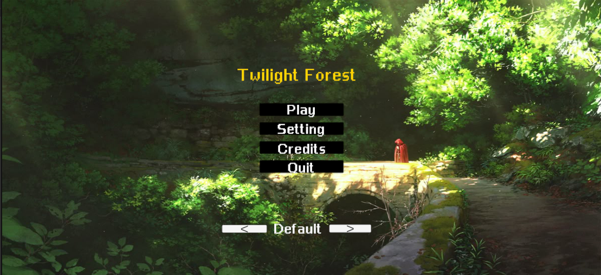
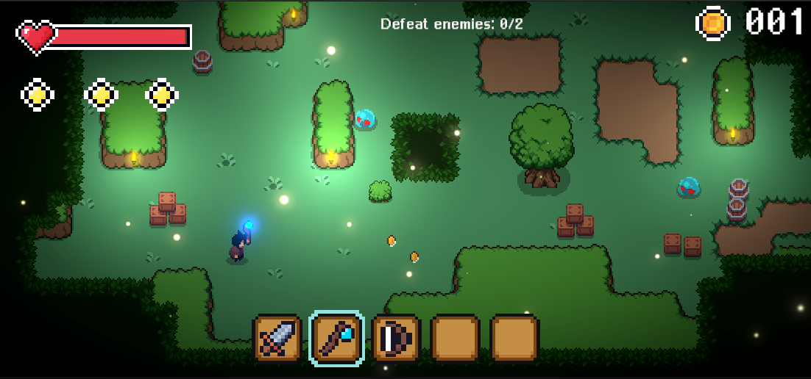
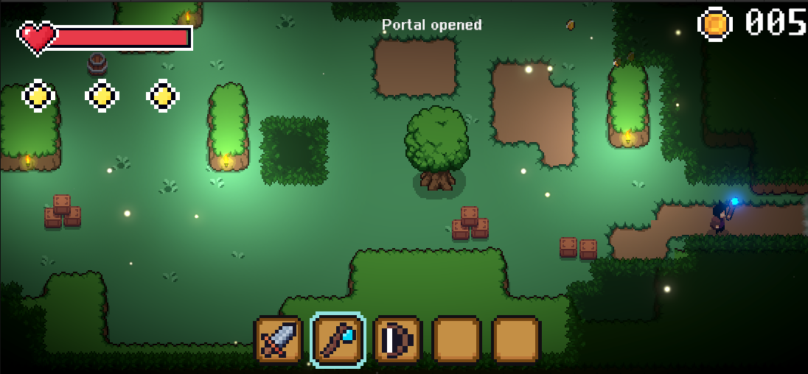
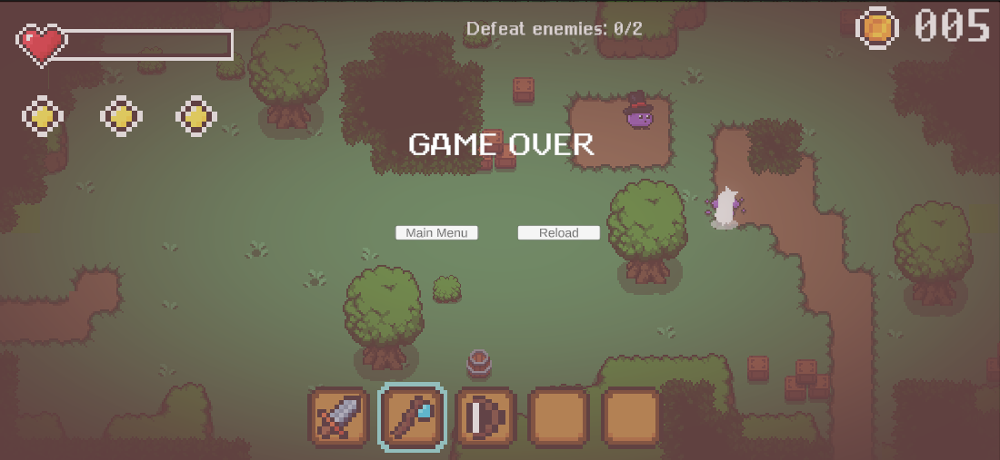

# Twilight Forest

Twilight Forest là game 2D phiêu lưu RPG - hành động được xây dựng bằng Unity. Người chơi điều khiển nhân vật khám phá màn chơi, chiến đấu với kẻ địch, hoàn thành nhiệm vụ để mở cổng và chuyển sang màn tiếp theo.

Game tập trung vào vòng lặp gameplay cơ bản: di chuyển, tấn công, thu thập vật phẩm, quản lý máu/stamina, hoàn thành nhiệm vụ, Game Over và chơi lại.

## Gameplay

### Main Menu



### Gameplay



### Objective & Portal



### Game Over



## Tính Năng Chính

- Di chuyển nhân vật 4 hướng bằng bàn phím.
- Tấn công kẻ địch và xử lý hiệu ứng khi enemy bị đánh.
- Nhặt vật phẩm như vàng, hồi máu và hồi stamina.
- Hệ thống nhiệm vụ mở cổng: người chơi cần hoàn thành mục tiêu trước khi chuyển màn.
- Hiển thị tiến độ nhiệm vụ trên giao diện.
- Pause Menu: tạm dừng, tiếp tục chơi hoặc quay về menu chính.
- Game Over: chơi lại màn hiện tại hoặc quay về menu chính.
- Âm thanh: nhạc nền, đánh quái, nhận sát thương, chuyển màn và Game Over.
- Cảnh báo máu thấp khi nhân vật sắp chết.
- Chọn skin nhân vật và lưu lựa chọn bằng `PlayerPrefs`.

## Công Nghệ Sử Dụng

- Unity `6000.3.10f1`
- C#
- Unity 2D
- Rigidbody2D / Collider2D
- Unity New Input System
- TextMeshPro
- Unity UI Canvas
- Git / GitHub

## Hướng Dẫn Cài Đặt Và Chạy

### Chạy bằng Unity Editor

1. Clone repository:

   ```bash
   git clone https://github.com/0Yaam/Twilight-Forest.git
   ```

2. Mở Unity Hub.
3. Chọn **Add project from disk**.
4. Chọn thư mục project vừa clone.
5. Mở project bằng Unity `6000.3.10f1`.
6. Mở scene:

   ```text
   Assets/Scenes/MainMenu.unity
   ```

7. Bấm **Play** để chạy game trong Unity Editor.

### Chạy bản build

```text
Builds/window/Twilight-Forest.exe
Builds/macos/macos.app
```

## Điều Khiển Cơ Bản

| Phím / Thao tác | Chức năng |
|---|---|
| `W A S D` hoặc phím điều hướng | Di chuyển nhân vật |
| Chuột trái / phím tấn công đã cấu hình | Tấn công |
| `Esc` | Mở / đóng Pause Menu |
| Nút UI | Play, chọn skin, Resume, Restart hoặc quay về Main Menu |

## Thành Viên

| MSSV | Họ tên |
|---|---|
| 2312616 | Phan Trung Hiếu |
| 2312590 | Nguyễn Ngọc Trường Dân |
| 2312756 | Nguyễn Hưng Thịnh |

## Phân Công

### 5.2. Chi tiết công việc từng thành viên

- **Nguyễn Ngọc Trường Dân — Vai trò: Developer**
   - Công việc 1: Xây dựng màn hình Game Over — hiển thị khi nhân vật hết máu, tích hợp nút chơi lại và về menu.
   - Công việc 2: Tích hợp hệ thống âm thanh — nhạc nền, âm thanh khi nhận sát thương, chuyển màn và Game Over.
   - Công việc 3: Xây dựng hệ thống nhiệm vụ — điều kiện tiêu diệt đủ quái hoặc thu thập vật phẩm để mở cổng dịch chuyển.

- **Phan Trung Hiếu — Vai trò: Developer**
   - Công việc 1: Xây dựng màn hình Menu chính — bắt đầu game, chọn skin, xem thông tin nhóm và thoát game.
   - Công việc 2: Xây dựng hệ thống chọn skin nhân vật — 4 màu Default/Blue/Red/Purple, lưu bằng `PlayerPrefs` và tự áp dụng khi vào game.

- **Nguyễn Hưng Thịnh — Vai trò: Developer**
   - Công việc 1: Xây dựng chức năng Pause/Tạm dừng — cho phép tạm dừng, tiếp tục hoặc quay về menu chính.
   - Công việc 2: Hiển thị mục tiêu nhiệm vụ trên giao diện HUD — số lượng quái cần tiêu diệt hoặc vật phẩm cần thu thập.
   - Công việc 3: Cảnh báo máu thấp — thanh máu nhấp nháy khi HP còn 1 để cảnh báo người chơi sắp chết.

## Video Demo
https://youtu.be/V7Omq_vmti8<br>
https://drive.google.com/file/d/1ARInseW_-7nI5rH4v1inXroOgSqaZ-YB/view?usp=sharing

